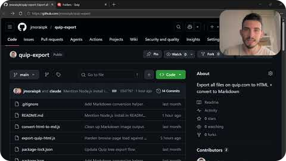

# Quip HTML Exporter

[](https://nodejs.org/)
[](https://playwright.dev/)
[](#getting-started)

<a href="https://youtu.be/LE-sSiiLw6I" target="_blank" rel="noopener"></a>

This project uses Playwright and Node.js to export all Quip files to HTML (and, optionally, to Markdown).

- ⚡ Export 500 files in 20 minutes
- 📁 Preserve Quip's folder hierarchy
- 🖼️ Keep images, links, and tables intact
- 🔁 Re-run and skip already-exported files

## Getting Started

1. Download or clone this repository.
2. Install [Node.js](https://nodejs.org/) and the required dependencies:

```bash
npm install
npx playwright install chromium
```

3. Start the exporter so Playwright opens Chromium:

```bash
npm start
```

4. On the very first run, log in to Quip in the Chromium window that Playwright opens. The exporter polls every few seconds and starts automatically once login is detected.
5. After the export has started, you can leave the window open, move it to the background, or minimize it while the script continues.

## Output

Exports are written under `exports/` and mirror the Quip tree the script discovers.

Example:

```text
exports/
  folder 1/
    folder 2/
      file 1.html
    folder 3/
      file 2.html
  .quip-export-state.json
```

The state file records successful exports so reruns skip files that were already downloaded.

## Optional Environment Variables

- `HEADLESS=1`: run headless instead of headed
- `QUIP_URL=https://quip.com/`: override the initial Quip URL
- `BROWSE_URL=https://quip.com/browse`: override the browse/folder root URL
- `MAX_RETRIES=3`: override per-document export retries

## Optional: Convert HTML Exports To Markdown

If you have [Pandoc](https://pandoc.org/) installed, you can optionally convert the exported HTML files into a mirrored `exports_md/` directory and download Quip-hosted images into `exports_md_media/`. Pandoc is a separate tool and is not installed by `npm install`.

Run:

```bash
npm run convert:md
```

This optional script:
- keeps the folder structure in `exports_md/`
- downloads Quip image URLs into `exports_md_media/`
- rewrites image references before running Pandoc
